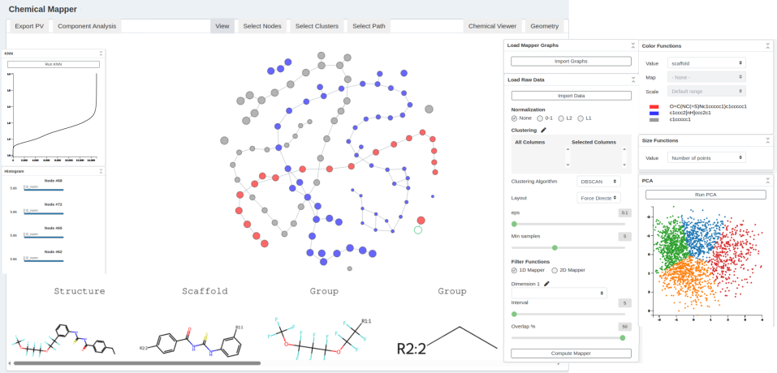

# Mapper Interactive for Chemical Space Exploration

**Chemical Mapper** is a specialized extension of the Mapper algorithm for **topological data analysis (TDA)**, developed to enable large-scale, interactive visualization of **chemical space**. It provides a graphical, chemistry-focused interface for exploring millions of molecular structures, their relationships, and their topological organization.

The underlying Mapper algorithm was introduced by Singh, Mémoli, and Carlsson (2007) as a tool for extracting topological information from high-dimensional datasets.  
**Reference:** [Singh et al., 2007](http://dx.doi.org/10.2312/SPBG/SPBG07/091-100)

This repository adapts Mapper for cheminformatics workflows, integrating molecular structures, scaffolds, physicochemical properties, and geometry-based statistics into an interactive web interface.

---

## Table of Contents

1. [Installation](#Installation)  
2. [Dependencies](#Dependencies)  
3. [Interface Overview](#Interface-Overview)  
4. [Main Interface Components](#Main Interface-components)  
   - [Mapper Graph (Central Panel)](#mapper-graph-central-panel)  
   - [Load Mapper Graph (Right Panel)](#load-mapper-graph-right-panel)  
   - [Load Raw Data Panel](#load-raw-data-panel)  
   - [Color Functions](#color-functions)  
   - [Size Functions](#size-functions)  
   - [PCA Visualization](#pca-visualization)  
   - [KNN Graph](#knn-graph)  
   - [Histogram Panel](#histogram-panel)  
5. [Interaction Modes (Upper Panel)](#interaction-modes-upper-panel)  
   - [Chemical Viewer](#chemical-viewer)  
   - [Geometry](#geometry)  
   - [Select Nodes / Clusters / Path](#select-nodes--clusters--path)  
   - [View Mode](#view-mode)  
   - [Component Analysis](#component-analysis)  
   - [Export PV](#export-pv)  
6. [Chemical Viewer Panel](#chemical-viewer-panel)  
7. [Tutorial for Reproducing the Paper’s Figures](##Tutorial for Reproducing the Paper’s Figures)

---

## Installation

```bash
git clone https://github.com/DhruvMeduri/chemical_mapper.git
cd chemical_mapper-EDF2
pip install -r requirements.txt
python3 run.py
```

Once launched, open the application in your browser (Chrome recommended):
http://127.0.0.1:8080/


## Dependencies
For the dependecies, just run `pip install -r requirements.txt`. Note that this has been developed in python==3.10.12.

# Interface Overview

The Mapper Interactive interface enables users to explore the **topology of chemical space** in an interactive and intuitive manner. Users can visualize molecular clusters, analyze chemical properties, and interpret scaffold-level relationships across large datasets. The image below illustrates the interface


---

# Main Interface Components

## Mapper Graph (Central Panel)

The Mapper graph is the core visualization element and represents the organization of chemical space based on user-selected filters, lenses, and clustering parameters.

Each node in the graph corresponds to a cluster of molecules, and edges represent overlaps between clusters.

### User interactions include:
- Dragging and repositioning nodes  
- Selecting nodes, clusters, or connected components  
- Performing property-based, PCA-based, or structural analyses on selected regions  

---

## Load/Compute Mapper Graph and Choosing Parameters (Right Panel)
### Load Pre-Computed Mapper Graph
This panel allows users to load **precomputed Mapper graphs** generated through the command-line interface (CLI). For more details go through `CLI_README.md`.
Using precomputed graphs from CLI is recommended for very large datasets (≥ 30,000 molecules).

#### Instructions:
1. Place the following files inside the `./CLI_examples` directory:
   - `*.json` Mapper graph  
   - `processed_data.csv`  
   - `wrangled_data.csv`  
2. Select the `./CLI_examples` folder through the `Import Graphs` button.

The `RUN.sh` script can automatically generate these required files when provided with the appropriate input data by running the `mapper-interactive-cli.py` file.

#### Precomputed Graphs for Large Datasets  
Mapper graphs for datasets up to **2 million molecules** are available for download:

**Google Drive Link:**  
https://drive.google.com/drive/folders/1IWWD0PDI--ge50UQTBtdk43kxaxZWN7-?usp=sharing

---

### Load Raw Data

Upload raw `.csv` datasets to compute Mapper graphs directly within the interface through the `Import Data` button. Ensure that the file has the following columns
### Required columns:
- **Structure** – SMILES string or other molecular representation  
- **Label** – User-defined class or property  
- **Scaffold** – Precomputed scaffold information

Choose the appropriate parameters for the mapper computation in this panel and finally compute it through the `Compute Mapper` button.

---

### Color Functions

Allows users to apply color maps to Mapper nodes based on any chosen molecular property (e.g., molecular weight, activity, polarity).  
This is useful for visually identifying gradients or clusters based on specific properties.

---

### Size Functions

Allows users to scale the size of nodes based on properties such as:
- Number of molecules in the node  
- Average value of a user-selected property  

This helps highlight dense or chemically significant regions in the graph.

---

### PCA Visualization

Computes and displays a **Principal Component Analysis (PCA)** projection of all molecules contained in selected nodes or clusters.

This provides a geometric representation of relationships and structural diversity within the selected chemical space.

---

### KNN Graph

Displays the **k-nearest-neighbor graph** of the full dataset.  
This visualization helps users choose appropriate neighborhood parameters, such as the ε used in clustering for Mapper construction.

---

### Histogram Panel

Shows aggregated statistics for selected nodes or clusters, including:
- Mean property values  
- Distributions of molecular properties  

The metrics shown can be modified by adjusting a small portion of the underlying code.

---

## Interaction Modes (Upper Panel)

### Chemical Viewer

Displays detailed chemical information for all molecules in the selected nodes, including:
- 2D molecular structures  
- Scaffold decomposition  
- Functional group breakdown  
- Property annotations  

---

### Geometry Mode

Visualizes structural geometric information via boxplots, including:
- Bond lengths  
- Bond angles  

These statistics are aggregated across all molecules in the selected node(s).

---

### Select Nodes / Clusters / Path

Allows users to interactively select:
- Individual nodes  
- Entire clusters  
- Graph paths  

These selections can then be analyzed through PCA, histograms, or the chemical viewer.

---

### View Mode

Clears all current selections, restoring the default visualization of the Mapper graph.

---

### Component Analysis

Focuses on one connected component of the Mapper graph at a time.  
This reduces visual clutter and enables detailed exploration of local structures.

---

### Export PV

Exports the currently visualized Mapper graph (or the currently viewed component) as **VTK files**.  
These files can be opened in **ParaView** for high-quality 3D visualization and further analysis.

---

## Chemical Viewer Panel

Located directly beneath the Mapper graph, this panel provides detailed chemical insights for selected nodes, including:
- 2D molecular structures  
- Scaffold and functional group decomposition  
- Annotated molecular properties  

This panel is essential for chemically interpreting the topology and clustering patterns observed in the Mapper graph.

## Tutorial for Reproducing the Paper’s Figures

Please use the link below. The videos in the folder guide you through reproducing the observations shown in the paper (**reproduce_figs**) and exporting/rendering the results in ParaView (**export_PV**).

**Google Drive Link:**  
https://drive.google.com/drive/folders/1grx1dcYGW--wzrxnrw0d6pwW3fbigWgg?usp=sharing


